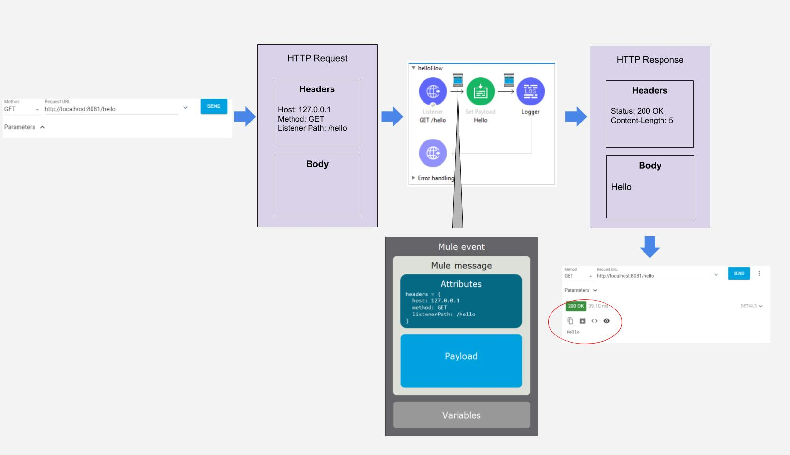
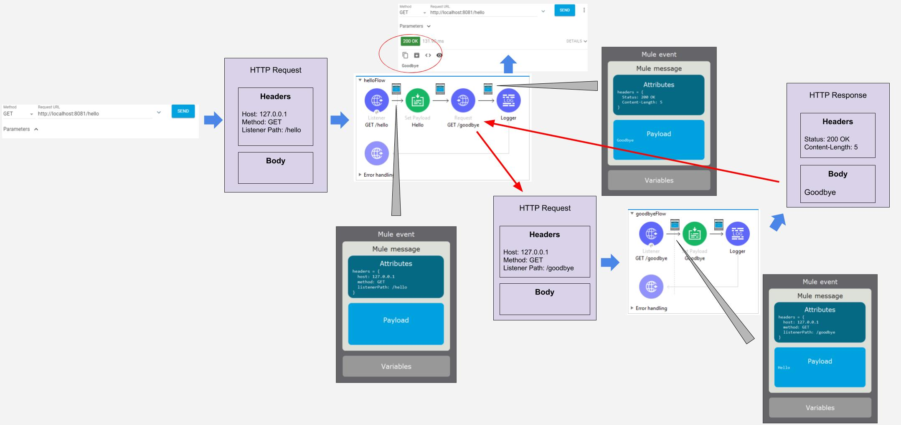
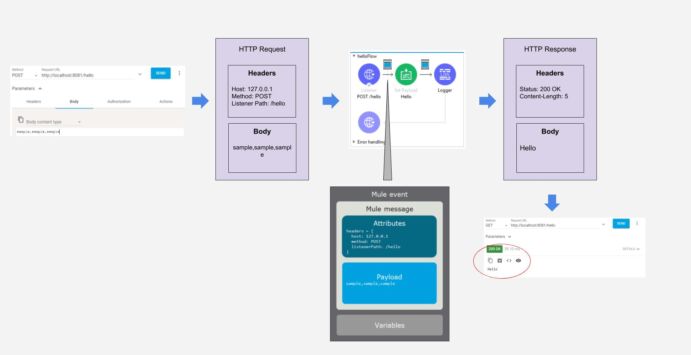

# MuleSoft training: DevFundamentals w/Mule-4

The contents in these folders contain solution files for walkthroughs covered each day.

What do these file types mean?

- .jar: most probably a MuleSoft app bundled as a .jar file

- .zip: most probably a RAML specification along with other associated RAML fragments

- .json or .xml: files used as sample data to build input/output schemas for DataWeave

 

## How to import the solution project .jar file into Studio?

- Download the .jar file from appropriate day's folder

- Start **Anypoint Studio** and connect to your workspace

- **Note**: If you plan to import a project whose name already exist, right-click on the prject and _delete_ it first (don't forget to select the _checkmark_ before deletion)

- Within **Package Explorer** section, right-click anywhere in white space, select **Import** to open the wizard

- Within **Import** wizard, exapnd **Anypoint Studio > Packaged Mule application (jar)** and click **Next**

- Browse and select the .jar file that you downloaded, and click **Finish**

- Wait till all necessary dependencies are downloaded (progress is indicated at the bottom-right corner of Studio)

- Now, you are ready to either add more content or run the mule app

 

## How to import the RAML solution into Anypoint Design Center?

- Download the zip file that represents the RAML specification (no need to unzip it)

- Log into **Anypoit Platform**: https://anypoint.mulesoft.com

- Access **Design Center**.  Click **Create > Specification**

- Provide the name: **American Flights API** (note: if you aready have one by this name, remove/rename the first)

- Once the **API Designer** opens, click on **three-dots** at the top-left and select **Import**

- Click on **Choose File** and point to the zip file you downloaded

- Click **Import**, and select **Yes** if prompted to overwrite the existing .raml file

- Turn on **Mocking Service** (slider on top-right corner)

- Test your API.  When complete, turn off **Mocking Service**

- Publish your API to **Exchange** (there's a button for that too :)  Look at the top-right corner)

 

## Review (Day-2)

 

 

 